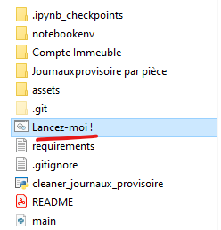

# Bienvenue sur le guide d'utilisation de mise en forme Excel des exports GERCOP
Cette application permet de correctement mettre en forme les exports de **Gercop** pour que la donnée soit mieux exploitable.

Il est attendu un fichier de type **.xls** en entrée et est produit un fichier de type **.xlsx** à la racine de ce même fichier.

1. Ouvrez le raccourci **Lancez-moi!**

2. Choisissez ensuite le fichier Excel que vous souhaitez convertir.

3. Choisissez ensuite le **type de fichier** puis cliquer sur **Formatter**.

4. Le fichier est bien généré et se trouve à la racine du fichier que vous avez souhaité convertir. Assurez-vous toutefois d'avoir bien sélectionné le bon format, car il est possible que le fichier soit tout de même généré même si le mauvais type de fichier a été sélectionné.

